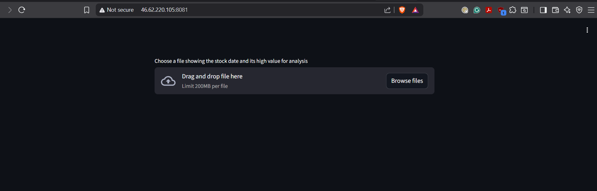
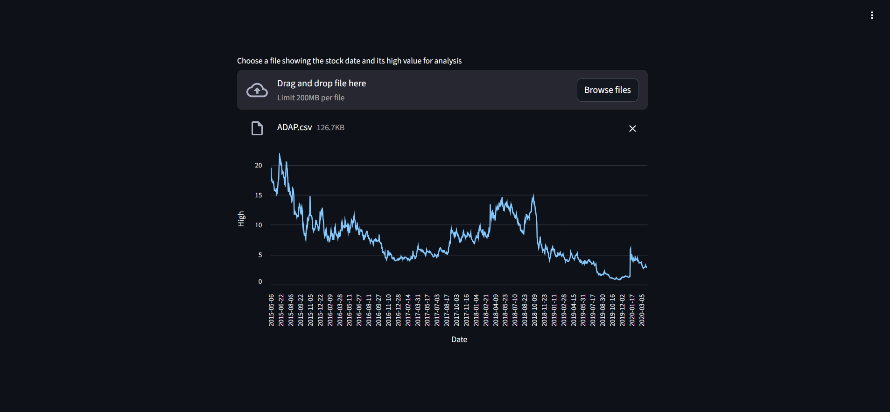

This is a simple Streamlit app. It can be accessed here http://46.62.220.105:8081/. 

Once you access the app, you will see the following

You can upload a file of your interest. For example, I am using stocks market dataset from Kaggle which can be downloaded from https://www.kaggle.com/datasets/jacksoncrow/stock-market-dataset?resource=download. Below I am showing the first 5 lines of ADAP stock 

After uploading a file, the trend of the stock will be represented via a plot as shown in the picture below 

The purpose of this simple application is mainly to highlight the infrastructure and tools required to deploy a service on a server 

